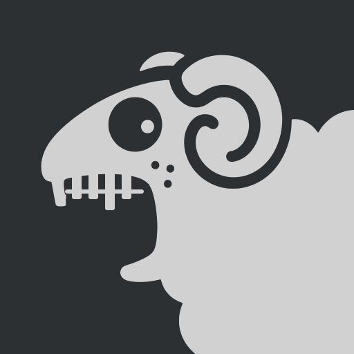

<p align="center">
  
</p>

# ermahgherdr 👾

A slim status **sidebar** for the [Claude Code](https://claude.ai/code) agents you
have running across tmux. It lives on the left edge of the screen and, at a
glance, tells you **which agent needs you right now** — navigate with arrows or
the mouse, hit Enter to jump straight to that pane.

Two names, one project: **ermahgherdr** is the project (module path, this repo);
**erma** is the command you type — the binary, the sway `app_id`, the tmux
option prefix (`@erma_*`), the contrib scripts (`erma-hook`, `erma-ctx`,
`erma-open`, `erma-sway-focus`) and their environment variables (`ERMA_*`).

Built with [Bubble Tea](https://github.com/charmbracelet/bubbletea) +
[Lip Gloss](https://github.com/charmbracelet/lipgloss).

## What it shows

Each running `claude` session is a two-line block — name on top, elapsed time
below — with a fixed left "meter" and, on the right, a `▸` arrow marking the
session your terminal is currently showing.

The name comes from the pane title claude publishes. Set the pane option
`@ctx_label` and that wins instead — for when something else already labels your
tmux tabs and the two should agree.

The panel reads **bottom-up**: the sessions and the counter row sit at the foot,
where your eyes already rest on a tall sidebar, and the mascot takes the empty
space above. `erma --top` mirrors that — counters and sessions at the top,
mascot at the bottom.

Status by color (**color means urgency, nothing else**):

- 🔴 **red** — needs you: a permission prompt is waiting.
- 🟢 **green** — unread: it finished and you haven't looked at the answer yet.
- 🟡 **amber** — processing: the agent is working (animated spinner), or waiting on background agents it started.
- ⚪ **gray** — idle: read / doing nothing (most sessions, most of the time).

Green clears the moment you actually see the pane — you jump to it from the bar,
or you focus the terminal with tmux showing it. Reading it in the bar's preview
(arrows) doesn't count; that's browsing, not reading.

`u` (or a right-click on the item) puts the green back: you read it and want it
to keep asking. That mark is pinned — unlike the automatic green it survives the
pane being right there in front of you, and only a deliberate jump, or the
session doing something new, clears it.

A violet **◔N%** under the name means that session is about to be auto-compacted:
only N% of the context is left. It sits beside the status color, never instead of
it, and shows up only while the session is low (≤ 15% by default) — see the
context segment below.

Cyan means only *you*: the selection band, the current-session arrow, and the
focused-header underline. When the bar has keyboard focus the little 👾 at the
bottom raises its hands.

## Requirements

- **tmux** — sessions are discovered as panes whose foreground command is `claude`.
- **sway** *(optional)* — powers the focus underline and the "jump keyboard focus
  to the target terminal" behavior. Without it the bar still lists and previews.
- **Go 1.24+** to build.

The bar itself needs only tmux. The helpers in [`contrib/`](contrib) add sway
(and, for `erma-open`, the [foot](https://codeberg.org/dnkl/foot) terminal) —
see [contrib/README.md](contrib/README.md).

## Install

From a checkout:

```sh
make install
```

Builds the `erma` binary and copies it, along with the four `contrib/erma-*`
scripts, into `$PREFIX/bin` (default `~/.local/bin`). Override with
`make install PREFIX=/somewhere/else`; on hosts where `go` is not on `PATH`,
pass it explicitly: `make GO=/usr/local/go/bin/go install`.

`make uninstall` removes exactly those five files and nothing else.

Alternative for the binary only:

```sh
go install github.com/daronco/ermahgherdr/cmd/erma@latest
```

## Setup

Make sure `~/.local/bin` is on your `PATH`, then wire the pieces you want.

### Claude Code hooks and status line

erma reads the live state from a tmux pane option `@erma_wait` that a Claude
Code hook keeps updated. The `statusLine` segment adds the "% until
auto-compact" number and flags the session in the bar when it runs low
(`ERMA_CTX_WARN`, default 15). In `~/.claude/settings.json`:

```json
{
  "hooks": {
    "Stop":             [{ "hooks": [{ "type": "command", "command": "~/.local/bin/erma-hook stop" }] }],
    "Notification":     [{ "hooks": [{ "type": "command", "command": "~/.local/bin/erma-hook notify" }] }],
    "UserPromptSubmit": [{ "hooks": [{ "type": "command", "command": "~/.local/bin/erma-hook submit" }] }]
  },
  "statusLine": { "type": "command", "command": "~/.local/bin/erma-ctx" }
}
```

The hook only ever sets `perm`, `working` and `done`; `waiting` (= read) is
written by the bar itself, when you look at the pane.

None of those marks is trusted on its own. A mark is set by one hook and cleared
by another, so a turn that ends without a Stop hook — you esc out of a prompt,
you decline a question — used to strand the session on red for good. The bar
reads the bottom of each pane every poll and lets the screen decide whether the
agent is actually working and whether a prompt is actually up. What the hook
adds on top is the part the screen can't show: that a stopped session is
*unread* rather than merely idle.

So without the hook the bar still gets 🟡 and ⚪ right — it just can't tell 🔴
and 🟢 apart from a session sitting quietly.

### sway

```
# open/focus the bar
bindsym $mod+c exec erma-open
# a slim left strip
for_window [app_id="erma"] floating enable, resize set 12 ppt 96 ppt, move position 0 ppt 2 ppt
# record the last real terminal so Enter in the bar returns focus to it
exec_always erma-sway-focus
```

Without `erma-sway-focus`, 🟢 clears only when you jump from the bar — telling
"you are looking at the session" from "it is merely the active tmux pane while
you read your mail" needs to know which window has the keyboard, which is a sway
question.

### tmux options and state-file contract

erma, `erma-hook`, `erma-ctx` and `erma-sway-focus` talk to each other through
a handful of tmux options and one state file. See
[contrib/README.md](contrib/README.md) for the full table.

## Keys

`↑/↓` (or `j/k`) move · `Enter` / click jump to the session · `r` reload · `q` quit.

`u` / right-click marks a session unread again. `alt+<n>` jumps straight to tmux
window `<n>`. `s` toggles the sound, same as clicking the badge in the counter
row.

---

Made for [Dai](https://github.com/daronco) 👾
